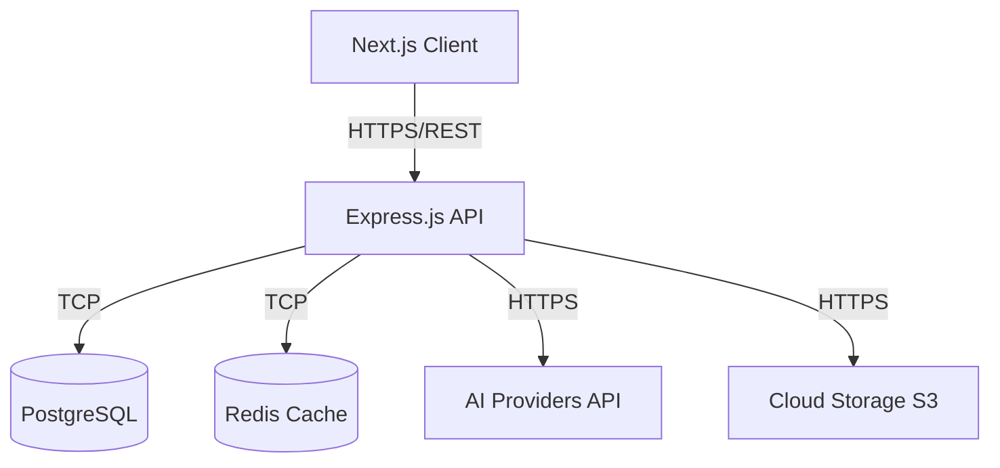

# QuizCraft Architecture

This document provides a comprehensive overview of the QuizCraft Phase 20 system architecture.

## High-Level Architecture

QuizCraft follows a decoupled, client-server architecture consisting of a Next.js frontend, an Express.js backend API, a PostgreSQL database managed by Prisma, and integration with external AI services.

## 1. Frontend (Next.js)

The frontend is a React-based application built with **Next.js (App Router)**.
- **Rendering:** Uses Server-Side Rendering (SSR) for SEO and initial load performance, and Client-Side Rendering (CSR) for interactive quiz taking.
- **State Management:** Uses React Context and Zustand for global state, and React Query for asynchronous data fetching and caching.
- **Styling:** TailwindCSS for utility-first styling with a custom design system.
- **Hosting:** Deployed via Vercel or standard Node.js server.

## 2. Backend (Express.js)

The backend is built with **Node.js** and **Express.js**.
- **Architecture:** Controller-Service-Repository pattern.
- **Routing:** Versioned API routes (`/api/v1/...`).
- **Middleware:** Validation (Zod), Authentication (JWT/Passport), Rate Limiting (express-rate-limit), Logging (Winston/Morgan).
- **WebSockets:** Uses Socket.io for real-time multiplayer quizzes and live analytics updates.
- **Hosting:** Dockerized containers deployed on AWS ECS / Kubernetes.

## 3. Database Layer (Prisma & PostgreSQL)

- **ORM:** Prisma is used for type-safe database access and schema migrations.
- **Database:** PostgreSQL is the primary relational database storing users, quizzes, attempts, and analytics.
- **Connection Pooling:** PgBouncer or Prisma Accelerate for handling large connection volumes.

## 4. Caching & Message Queue (Redis)

- **Caching:** Redis caches frequent read queries (e.g., popular quizzes, user profiles).
- **Rate Limiting Store:** Backs the API rate limiting logic.
- **Queueing:** BullMQ (on Redis) is used for asynchronous tasks such as AI generation, sending emails, and background report generation.

## 5. AI Integration

The backend communicates with AI providers (OpenAI / Gemini) for:
- Automated Quiz Generation from text/PDFs.
- Detailed Answer Evaluation (for subjective questions).
- Personalized Learning Recommendations.

## 6. Containerization & Orchestration

The entire backend ecosystem is containerized using **Docker**. **Docker Compose** is used for local development, providing a seamless multi-container environment (Node, Postgres, Redis). Production environments utilize Kubernetes for auto-scaling and self-healing.
